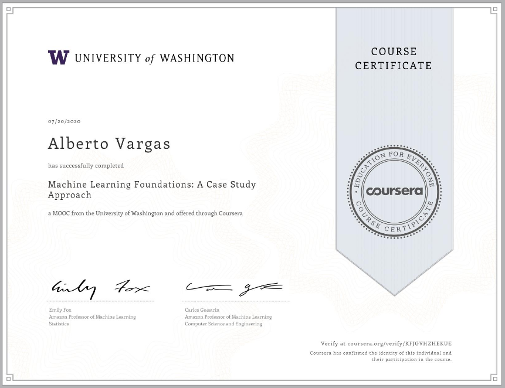

# Machine Learning Specialization. Washington University

I was curiouos about TuriCreate and Graphlab, with its distributed processing and useful tools. Also, performing the required tasks with pandas, sk-learn and matplotlib/seaborn instead could be a nice chance to reinforce my knowledge with this libraries. 

https://www.coursera.org/specializations/machine-learning

- 1st course: General approach.

- 2nd course: Regression

-----------------------
-----------------------

# **Personal notes:**

# Graphlab

- It seems to work like pandas but storing info in hard drive instead of memory, also it has its own ml algorithms and displaying tools.

----------------------
-------------------------