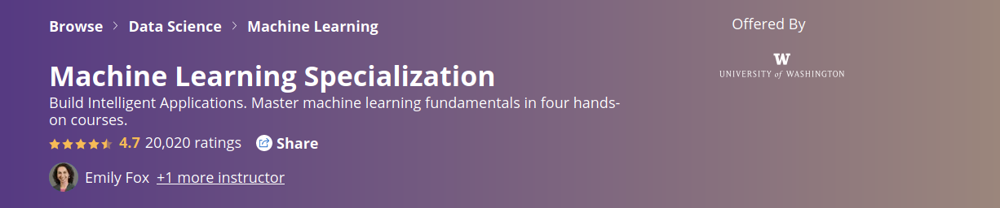

# Machine Learning Specialization. Washington University

I was curiouos about TuriCreate and Graphlab, with its distributed processing and useful tools. Also, performing the required tasks with pandas, sk-learn and matplotlib/seaborn instead could be a nice chance to reinforce my knowledge with this libraries. 

https://www.coursera.org/specializations/machine-learning

- 1st course: General approach.

https://www.coursera.org/account/accomplishments/verify/KFJGVHZHEKUE

- 2nd course: Regression

https://coursera.org/share/a20947e43d4346e3b44fcc947f70fc8f

-----------------------
-----------------------

# Graphlab

It is kind of a pandas with sk-learn and interactive visualizations, all in once.

I must say the ML work is way easier with GrapLab and TuriCreate. It has a lot of pre-built tools that make life way easier... And that's the plan, reinforce knowledge performing all required processed the hard way, with pandas, sklearn and matplotlib. 

----------------------
-------------------------