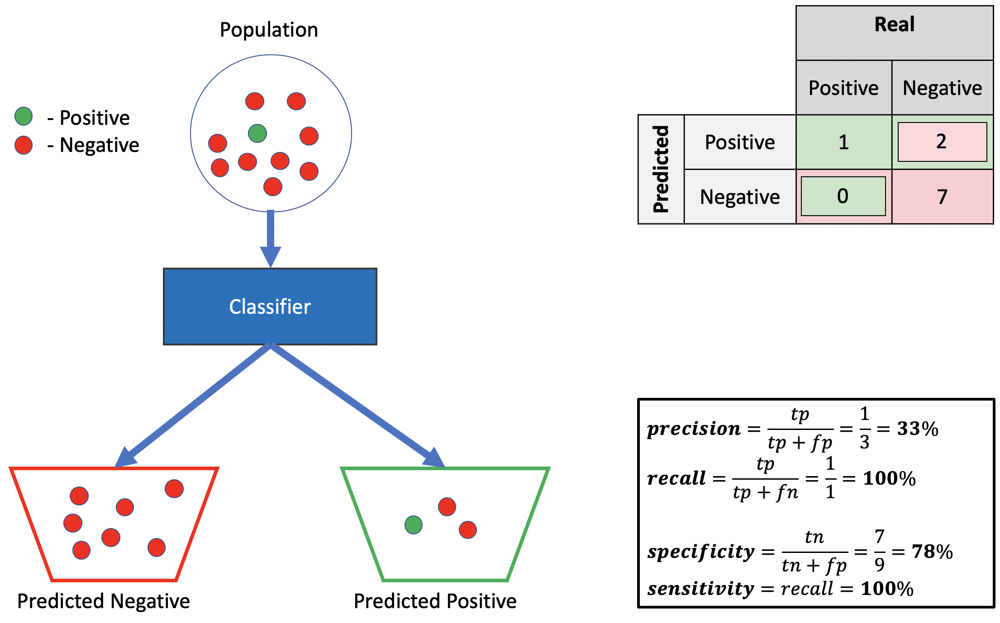
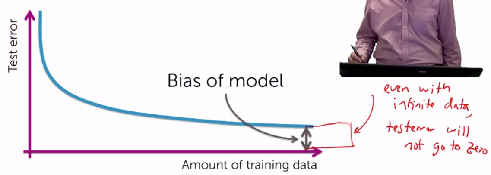

# Classification error and accuracy

- error = (# of mistakes) / (total #) = 1 - accuracy ; error € [0,1], the lowest the better.

- accuracy = (# of correct) / (total #) ; accuracy €[0,1]. The hightest the better.

What's good accuracy?

For binary classification in a balance dataset half the time it predicts right by default => accuracy = 0.5, so do it better.

- For k classess accuracy = 1/k by default.

Then, is 90% accuracy good? It depends. If 90% of sent emails are spam, just saying all mails are spam you get 90% of accuracy.

- Check out:

    - Is there class imbalance?
    - How does it compare to a simple, baseline approach?
    - What accuracy range do I need? What is good enough?

False positives, false negatives, and confusion matrices.

------------------------

--------------

**- Precision** = positive predictive value = TP / (TP+FP)

    - Fraction of relevant instances among retrieved instances.

**- Recall** = sensitivity = TP/ (TP + FN)

    - Fraction of the total amount of relevant instances that were actually retrieved.

Example:

A ML algorithm identifies 8 dogs in a picture where there are 12 dogs and some cats. Of the identified dogs, 5 are really dogs (TP), and there are 3 cats identified as dogs (FP)

Precision = 5/8 
From all dogs identified, just 5 were actually dogs

Recall= 5/12
From all the dogs, just 5 were identified

*Internet picture.*

In the picture we see: 
- 1 TP
- 2 FP
- 7 TN
- 0 FN

**- Classification accuracy**.

Accuracy = nº of correct predictions / total of predictions = (TP+FN)/ total of samples

If 98% of samples are type A, our model can easily get 98% of training accuracy, so it's important to have a well balanced system if we'll trust this metric

**- Confusion matrix**.

        n=165       Predicted NO    Predicted YES

        Actual NO       50              10

        Actual YES      5               100

- TP    :   Predicted YES and actual output was YES.
- TN    :   Predicted   NO and the actual output was NO.
- FP    :   Predicted   YES   and the actual output was NO (the prediction is false).
- FN    :  Predicted NO  and the actual output was  YES.

**- AUC**:

Axis Y: TP rate
Axis X: FP rate

TP rate =   sensitivity =   TP / (FN+TP)
FP rate =   specificity =   FP / (FP+TN)

**- F1 score**:

F1  =   2   /   (1/precision + 1/recall)

It tries to find a balance between both metrics

**- MSE**:

Is the average of the square difference between the Original Values and the Predicted Values. Due to the ², higher errors are highlighted and we can work them out.

**- When using each metric**:

https://medium.com/usf-msds/choosing-the-right-metric-for-machine-learning-models-part-1-a99d7d7414e4

# Bias

- Models with less bias tend to need more data to perform well, but do better with sufficient data.