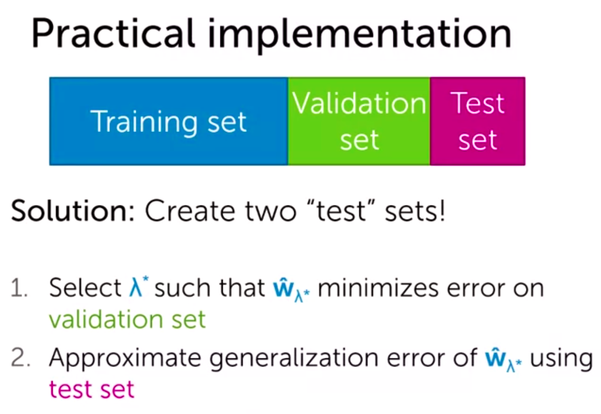
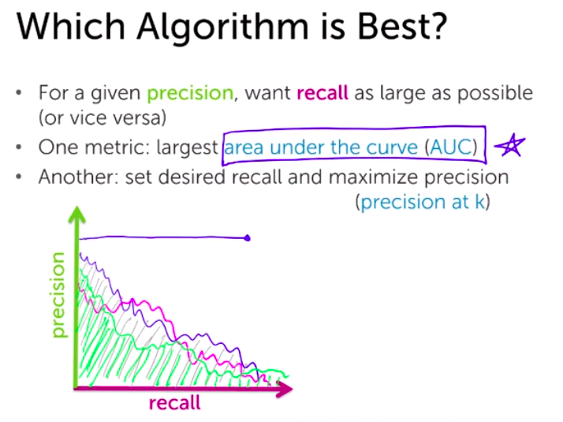
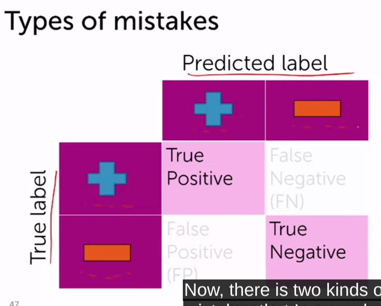
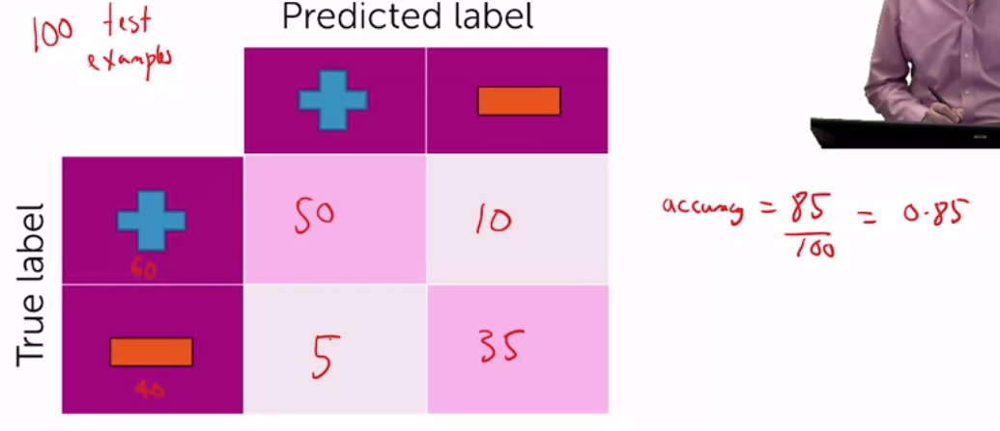
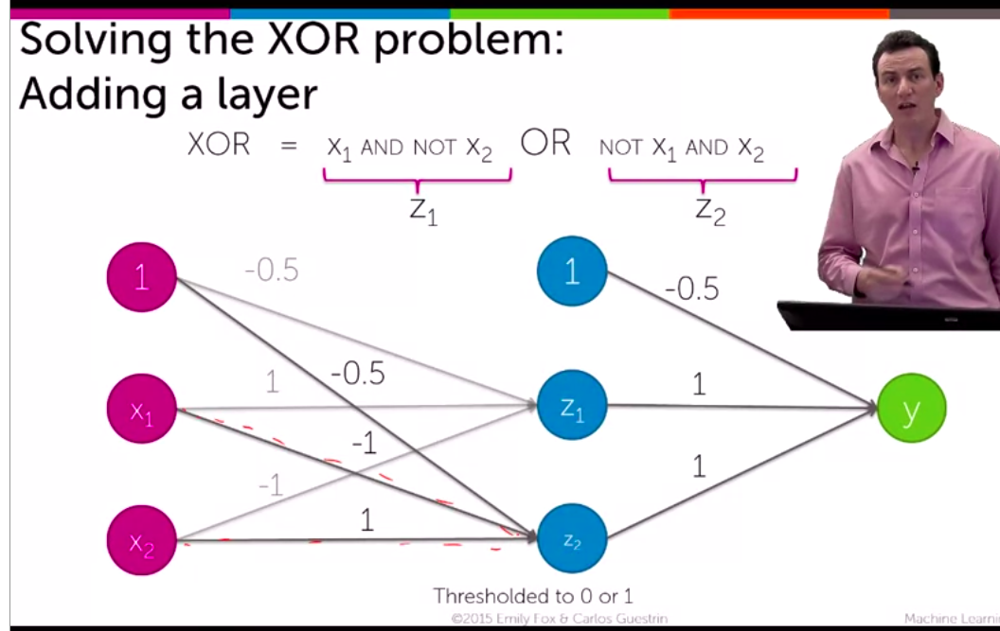
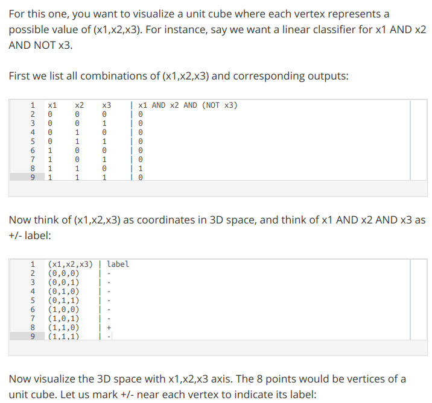
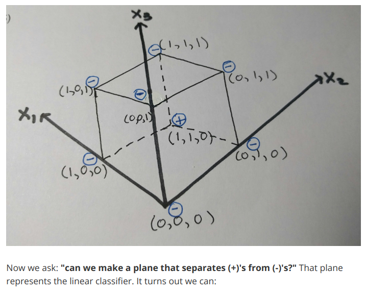
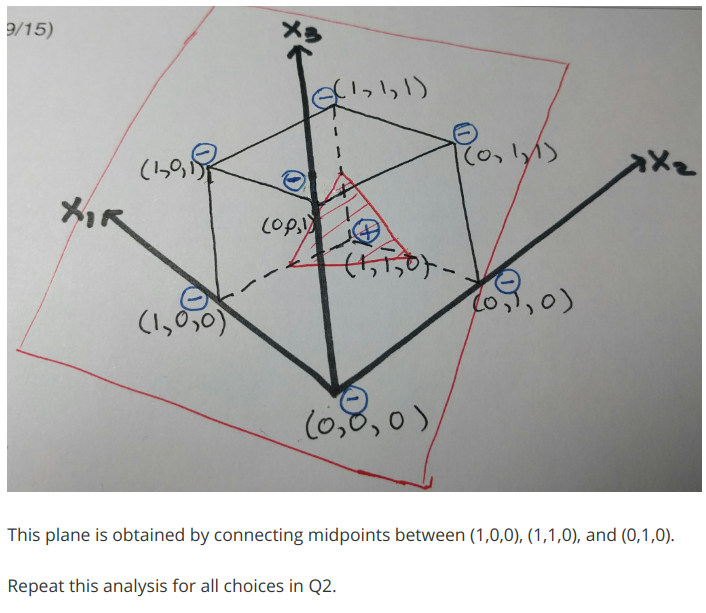
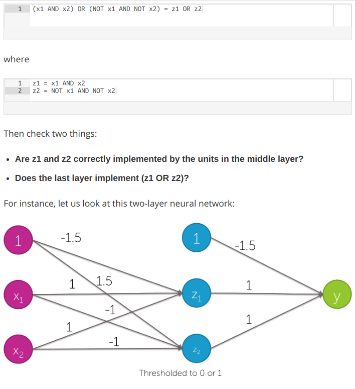
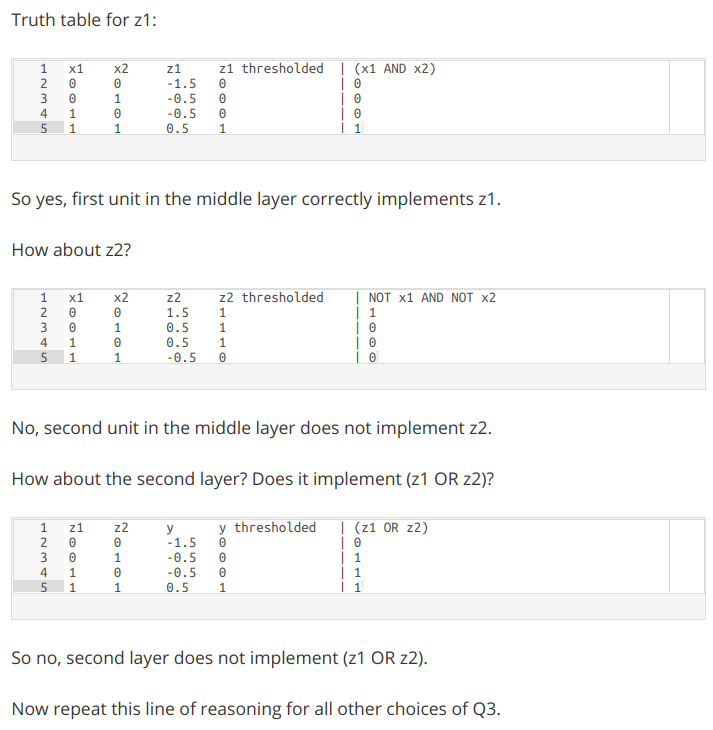

# Personal notes. 

Hi! I like taking notes, and this are quite chaotic ones. One day I'll need to structure it, but that's a job for myself from the future.

*Markdown+Math VSCode extension required*

## Regression.

Check out Andrew NG notes.

**1st approach**: Regression model

Number of observations  (x_i, y_i) ≡ N

Number of inputs x(j) ≡ d

Number of features h_j(x) ≡ D

- Fitting curve (predicted elements):
$$f(x)=w_0 + w_1 x$$

- Then, the real points can be described as this fitting curve + error (vertical distance to the fitting curve) (sum for multiple regression):

 $$y_i= \sum _j ^D f(x_i)+\epsilon_i$$

 Algebra. Transposed vectors por scalar product.

- E == expected value (that means it can be above (+) or below (-) the general fitting curve . 

**Residual Sum of Squares RSS:**

$$RSS(w_0,w1)≡\sum(y_i-f(x_i))²$$
- We are just adding the errors² 

In a D-dimensional curve:

$$RSS(w_0,w1)≡\sum(y_i-h(x_i)^T w)² = (y-Hw)^T (y-Hw)$$

Finding the best fitting courve means minimizing the RSS (with Matlab could be taking derivatives and job done)

$$\nabla_(w_0,w_1) RSS(w_0,w1)= \begin{pmatrix} -2 \sum_i ^N [y_i - (w_0+_w1 x_i)] \\ -2 \sum_i ^N [y_i - (w_0+_w1 x_i)] x_i \\  \end{pmatrix} = 0$$

- In the 2-d plane made by w_0, w_1, the points minimizing this eq are: $$ŵ_0, ŵ_1$$

In a D-dimensional curve:

$$\nabla RSS(w)= \nabla (y-Hw)^T (y-Hw) = -2H^T(y-Hw)$$

=> algebra & identity properties => $$ŵ=(H^T H)^{-1} H y$$

H invertible <=> N >D (N = number of LD observations, D = number of features). Cost of computing:
$$H^T H ≈ ND^2 + D^3$$  so, it can be really expensive to compute  and we need to find an alternative => **gradient descent**

- And then taking the 2nd derivative to check max/minimum

**Numerical way:**  Hill climbing algorithm/ Hill descent:

While not converged:

$$w^(t+1) = w^t  ± \eta  \nabla_w g(w)$$

$$ t = iteration; \eta=stepsize$$ 

$$ + =>  climbing; - =>  descent$$ 

$$ \nabla_w  g(w) = \begin{pmatrix} \delta g / \delta w_0 \\ \delta g / \delta w_1 \\ \delta g / \delta w_2 \\ ... \end{pmatrix}$$

D-dimensional gradient descent:

$$w^(t+1) = w^t  +2 \eta \sum _{i=1} ^N h_j (x_i) (y_i - h^T (x_i)w^{(t)}) $$

This well explained in Andrew NG course

When the derivative is positive, we want to decrease *w*, when it's negative, we want to increase it.

**Choosing the stepsize:** Common choices:

- Decrease it with iteration *t*

$$\eta_t=\alpha /t$$ 
or $$\eta_t=\alpha /sqrt(t)$$ 

- Ideally, the steps end when $$\delta g(w) / \delta w =0$$

This is ideal, we can't wait eternally to converge. So we say something like 

$$ |\delta g(w) / \delta w|<\epsilon $$

$$\epsilon ≡ threshold \cdot to \cdot be \cdot set$$ 

Gradient descent for multiple regression => find the implementation math

**Compute training error:**

- Define a loss function L(y, f_ŵ (x))
- Training error  ≡ average loss = $$1/N \sum_{i=1} ^N L (y_i, f_ŵ (x_i)$$ 

- $$RMSE = \sqrt{1/N \sum_{i=1} ^N L (y_i, f_ŵ (x_i))}$$

We'll compute the training error and generalization error(true one)

**Overfitting:**
- training error (ŵ)  > training error (w')
- true error (ŵ)  > true error (w')
 
 **Bias:** Difference between the average fit of my model and the true function. Low complexity => High bias

 $$Bias(x)=f_w (true) - f_ŵ (x) $$

**Variance:** How the same fit varies in different datasets. High complexity => High variance, low bias

**MSE** = bias² + variance => the goal is find the global minimum

**bias+noise**. Plotting amount of data VS Error, the error decreases while amout of data increases, but it never converges to zero. It tends to a line parallel to the x axis, so there's no point on computing infinitely. The y-distance between this line and the x axis is the bias+noise

- fit on training set
- select the model complexity (what model performs better, lower validation error) with the validation set
- assess the performance of that model with the test set

 -----------------

## Classification.

**Classification accuracy** => fraction of items correctly classified.

- To recommender systems we don't need what an user doesn't like.
- Maybe it is better to focus on how quickly can we discover the relatively few liked items (imbalanced class problem)

**Recall** => how many of the items I really like were actually recommended to me. It measures how much the recommender system covers what I really like.

**Precision** => from all the recommended items available, what fraction I really like. It measures how much I am going to waste my time on products I don't like.

- You can maximize recall just recommending everything, then recall tends to 1, but then precision tends to 0.

- Ideal perfect recommender: All the products I like and only the products I like. Everything I don't like was never shown to me => Precision=Recall=1 (obviously not possible)

Another: When you know specifically the number of items you have to recoomend, then use it at k==items you have.

# Classification error and accuracy (my way)

- error = (# of mistakes) / (total #) = 1 - accuracy ; error € [0,1], the lowest the better.

- accuracy = (# of correct) / (total #) ; accuracy €[0,1]. The hightest the better.

What's good accuracy?

For binary classification in a balance dataset half the time it predicts right by default => accuracy = 0.5, so do it better.

- For k classess accuracy = 1/k by default.

Then, is 90% accuracy good? It depends. If 90% of sent emails are spam, just saying all mails are spam you get 90% of accuracy.

- Check out:

    - Is there class imbalance?
    - How does it compare to a simple, baseline approach?
    - What accuracy range do I need? What is good enough?

False positives, false negatives, and confusion matrices.

------------------------

--------------

**- Precision** = positive predictive value = TP / (TP+FP)

    - Fraction of relevant instances among retrieved instances.

**- Recall** = sensitivity = TP/ (TP + FN)

    - Fraction of the total amount of relevant instances that were actually retrieved.

Example:

A ML algorithm identifies 8 dogs in a picture where there are 12 dogs and some cats. Of the identified dogs, 5 are really dogs (TP), and there are 3 cats identified as dogs (FP)

Precision = 5/8 
From all dogs identified, just 5 were actually dogs

Recall= 5/12
From all the dogs, just 5 were identified

*Internet picture.*

In the picture we see: 
- 1 TP
- 2 FP
- 7 TN
- 0 FN

**- Classification accuracy**.

Accuracy = nº of correct predictions / total of predictions = (TP+FN)/ total of samples

If 98% of samples are type A, our model can easily get 98% of training accuracy, so it's important to have a well balanced system if we'll trust this metric

**- Confusion matrix**.

        n=165       Predicted NO    Predicted YES

        Actual NO       50              10

        Actual YES      5               100

- TP    :   Predicted YES and actual output was YES.
- TN    :   Predicted   NO and the actual output was NO.
- FP    :   Predicted   YES   and the actual output was NO (the prediction is false).
- FN    :  Predicted NO  and the actual output was  YES.

**- AUC**:

Axis Y: TP rate
Axis X: FP rate

TP rate =   sensitivity =   TP / (FN+TP)
FP rate =   specificity =   FP / (FP+TN)

**- F1 score**:

F1  =   2   /   (1/precision + 1/recall)

It tries to find a balance between both metrics

**- MSE**:

Is the average of the square difference between the Original Values and the Predicted Values. Due to the ², higher errors are highlighted and we can work them out.

**- When using each metric**:

https://medium.com/usf-msds/choosing-the-right-metric-for-machine-learning-models-part-1-a99d7d7414e4

# Bias

- Models with less bias tend to need more data to perform well, but do better with sufficient data.

# NN basics

- NN basic

**Layers:**

